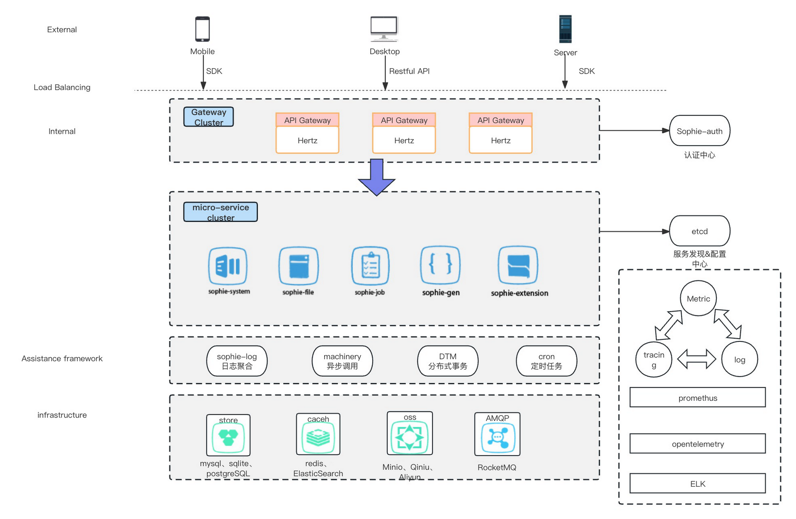

# Sophie

[English](README.md) | 中文

Sophie 基于Hertz + Kitex + Element UI 设计的前后端分离权限管理系统，个人及企业可基于此系统快速开发

## 特点
 - 采用前后端分离模式，前后端应用独立部署修改，灵活性强
 - 后端采用[字节跳动](https://www.cloudwego.io/)的Hertz 和 Kitex框架，框架提供了较多扩展接口，保证高性能的同时具有很强的扩展性
 - 后端采用gateway 架构，各个组件的微服务通过统一的sophie-gateway 暴露给外部
 - 后端遵循 RESTful API 设计规范
 - 采用基于 RBAC 的访问控制模型
 - 具有完备的缓存子系统、日志聚合子系统等
 - 提供分布式定时任务调度功能
 - 项目具备丰富的文档和测试，易于理解

## 系统架构

## 内置功能
1. 用户管理：对用户的属性、状态进行配置
2. 部门管理：使用树状结构对组织各个层级的属性、状态进行管理
3. 岗位管理：管理组织内部定义的岗位及其状态 
4. 菜单管理：拥有权限的角色可以管理系统的菜单进行编辑
5. 角色管理：根据角色来管理用户的权限，组织可以内部自定权限角色
6. 字典管理：字典由字典名称、字典类型、状态组成，由组织内部定义字典类型和该类型取值范围
7. 参数管理：参数由k-v 对表示，管理系统运行时参数设置，通过修改参数来修改管理系统的行为。
8. 通知公告：系统通知公告信息发布维护。
9. 操作日志：系统正常操作日志记录和查询；系统异常信息日志记录和查询。
10. 登录日志：系统登录日志记录查询
11. 在线用户：当前系统中活跃用户状态监控。
12. 定时任务：在线（添加、修改、删除)任务调度包含执行结果日志。
13. 代码生成：支持前后端代码的生成（java、html、xml、sql)支持CRUD下载 。
14. 系统接口：根据业务代码自动生成相关的api接口文档。
15. 服务监控：管理员可监控服务的调用链路，各个组件的服务状态等
16. 表单构建器：用户通过拖动组件及设置组件属性定义页面

## 在线演示
 - admin/admin123

演示地址: [https://49.234.183.205/](https://49.234.183.205/)

## 项目详情
[需求分析](docs/devel/requirements_analysis.md)
[技术选型](docs/devel/technology_selection.md)
[系统架构](docs/devel/architecture.md)
[部署指南](docs/guide/deployment.md)
[app启动配置及启动流程](docs/guide/app.md)

## 相关项目
 - [Sophie-ui](https://github.com/user823/Sophie-ui)

## 开源许可
Sophie 基于[Apache License 2.0](LICENSE) 许可证

## 联系方式
 - Email: hq869860837@163.com
 - Issues: [Issues](https://github.com/user823/Sophie/issues)
 - 企鹅: 869860837