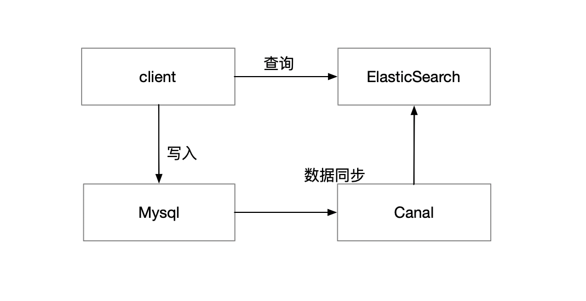

# Architecture

sophie-system 后台权限管理的核心
sophie-file 对外提供文件服务，访问对象存储系统等
sophie-job 即sophie-schedule，提供定时任务服务
sophie-gen 提供代码生成服务
sophie-extension 基于sophie的扩展子项目，可以使用其他语言实现

## sophie schedule

定时任务调度和定时任务日志获取 都是通过sophie-schedule完成，调度系统分为manager 节点和worker节点两个部分
当sophie-gateway 收到请求时，通过服务发现将请求发送到某个manager节点，manager节点会监控worker节点的状态，并应用负载均衡策略将任务调度到某个worker节点 ，
manager节点要监控worker 节点的状态（正常，挂起，离线）:
1. manager节点不会指派任务给挂起和离线的worker节点
2. manager不会调度挂起的worker节点
3. worker节点离线时（主动或被动），manager节点要将该worker上的job 调度到其他worker上（无worker可用时，标记任务为暂停状态），manager节点通过分布式锁保证全局每个任务只在一个worker实例上运行

由于每个任务只由一个manager节点负责调度，因此当manager节点在调度失败时，需要将该job加入到deadjobs 队列里面，deadjobs 队列中的任务每隔5s调度一次，调度失败时回到队尾
manager节点下线时如果deadjobs 非空则标记这些jobs为暂停状态

分布式锁和job状态 监控（基于发布订阅模式）都是通过etcd 实现

## Log Aggregation

日志聚合模块分为日志上报和日志采集两个部分 
数据上报系统将日志异步上传到Redis 内存数据库中，然后启动单独的日志采集服务处理日志能显著减少因上报日志产生的性能损耗
数据也可上报到rocketmq中（从而可以利用rocketmq 的消费特性），数据采集服务可以从多个中间管道收集日志，然后输出到多个输出端，上报日志称为RecordProducer
数据上报组件位于pkg/log/aggregation 中

数据采集是指sophie-logstash 组件，它包含输出日志称为RecordExporter、从中间管道获取日志RecordConsumer

## Cache System

缓存子系统使用redis(也可更换为其他缓存) 对底层数据源，比如mysql、ElasticSearch 的内容进行只读缓存
在访问缓存前通过bloom filter 来判断key是否在缓存中，如果不在则抽取底层数据库的数据，更新缓存；否则直接访问缓存
写入时设置redis中缓存无效，并直接写入底层数据源
当底层数据库也不存在数据时则缓存空值

ElasticSearch 对mysql 读取进一步进行缓存，数据只写入mysql，并通过canal工具定期从mysql中拉取数据到ElasticSearch中

