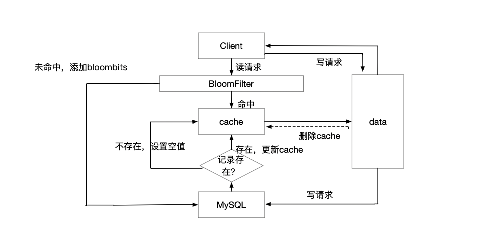

# Architecture

## Log Aggregation

日志聚合模块分为日志上报和日志采集两个部分 
数据上报系统将日志异步 异步上传到Redis 内存数据库中，然后启动单独的日志采集服务处理日志能显著减少因上报日志产生的性能损耗

## Cache System

缓存子系统使用redis 对底层数据源，比如mysql、ElasticSearch 的内容进行只读缓存
读未命中时，在访问底层数据源之间使用bloomfilter 判断数据是否存在
写入时设置redis中缓存无效，并直接写入底层数据源

ElasticSearch 对mysql 读取进一步进行缓存，数据只写入mysql，并通过NIFI工具定期从mysql中拉取数据到ElasticSearch中